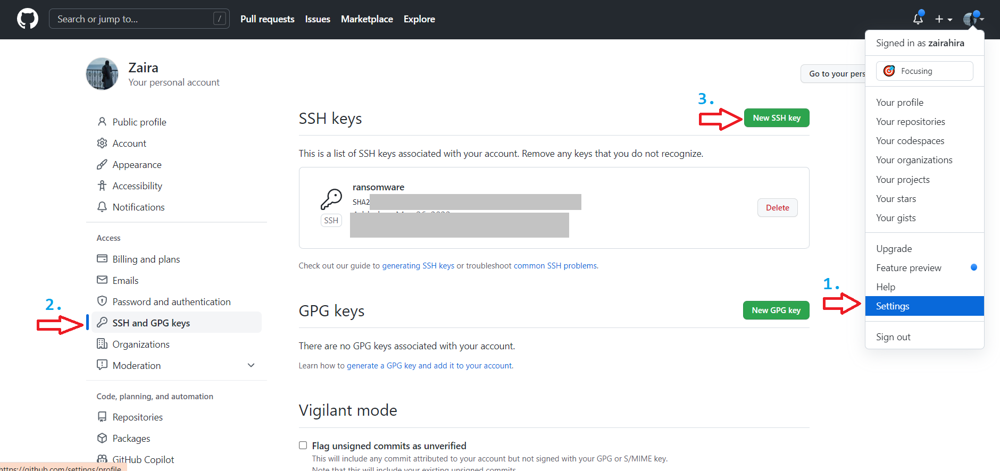
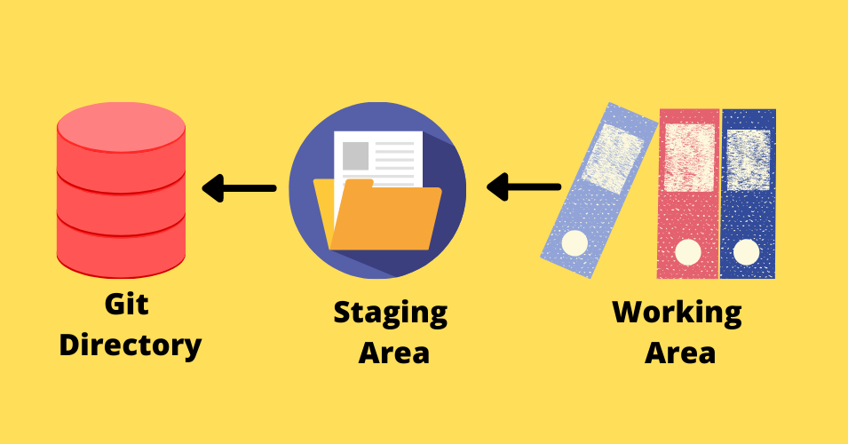
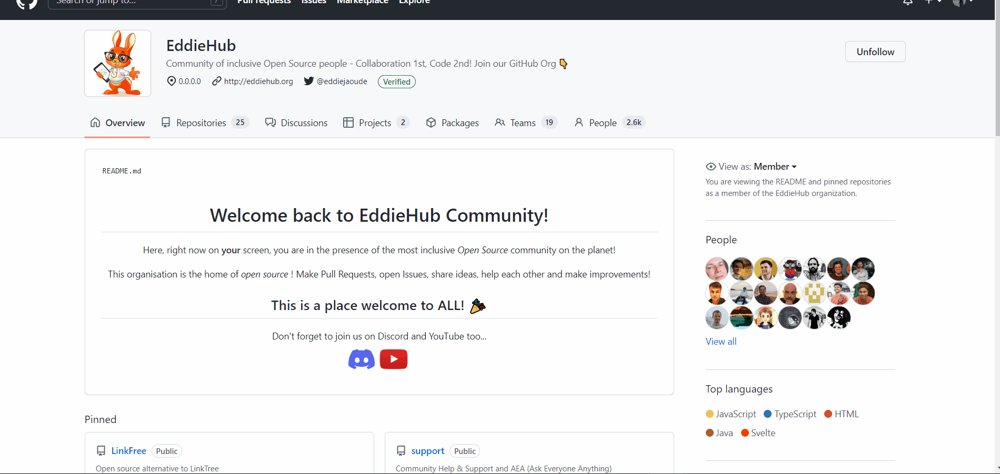
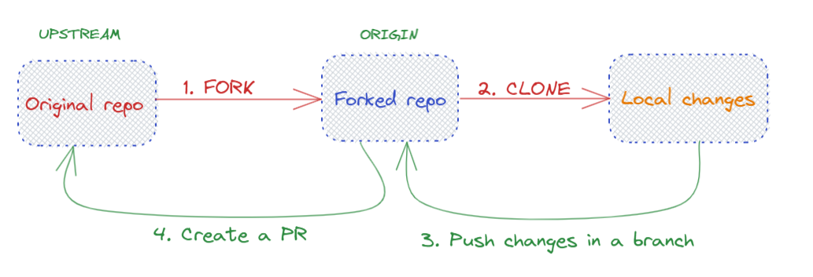

 # All the fool-proof important git commands

## 🙏 Contributing
Pull requests are welcome. For major changes, please open an issue first to discuss what you would like to change.

## Table of contents

- [Installing GitHub](#installing-github)
- [Configuring git for the first time](#configuring-git-for-the-first-time)
  - [Configure name](#configure-name)
- [Setting up SSH keys](#setting-up-ssh-keys)
  - [Add public key to your github account](#add-public-key-to-your-github-account)
  - [Add private keys to ssh agent.](#add-private-keys-to-ssh-agent)
- [Workflow of changes](#workflow-of-changes)
  - [Staging changes](#staging-changes)
  - [Committing changes](#committing-changes)
  - [Pushing the changes](#pushing-the-changes)
- [Working on changes from remote repository to local machine](#working-on-changes-from-remote-repository-to-local-machine)
- [Working on changes from local machine to remote repository](#working-on-changes-from-local-machine-to-remote-repository)
- [Git branches](#git-branches)
  - [Check which branch you are on.](#check-which-branch-you-are-on)
  - [Create and switch to a new branch](#create-and-switch-to-a-new-branch)
  - [Switch to an existing branch](#switch-to-an-existing-branch)
  - [Push to a feature branch](#push-to-a-feature-branch)
  - [Delete branches that are not in use](#delete-branches-that-are-not-in-use)
- [Forking](#forking)
- [Upstream- adding and reviewing upstreams](#upstream--adding-and-reviewing-upstreams)
  - [Add main upstream of original repo](#add-main-upstream-of-original-repo)
  - [Push changes to remote](#push-changes-to-remote)
- [Additional information](#additional-information)
  - [How to Recover a Deleted File in Git – Revert Changes After a Hard Reset](#how-to-recover-a-deleted-file-in-git--revert-changes-after-a-hard-reset)
    - [Revert file after committing changes:](#revert-file-after-committing-changes)
    - [How to Recover Files When Changes Are Staged but Not Committed](#how-to-recover-files-when-changes-are-staged-but-not-committed)
- [Git commit messages](#git-commit-messages)
- [Making your organization public.](#making-your-organization-public)
# Installing GitHub

- [GitHub for Windows](https://windows.github.com).
- [GitHub for Mac](https://mac.github.com).
- [Git for All Platforms](http://git-scm.com).

# Configuring git for the first time
Configure user information for all local repositories

- ## Configure email
Sets the email you want attached to your commit transactions:
```
git config --global user.email "[email address]"
```
## Configure name

Sets the name you want attached to your commit transactions:

```
git config --global user.name "[name]"
```

# Setting up SSH keys
To push your changes to the remote repo, you would need the SSH keys set up.

You can use the command below in `git bash` and get a pair of keys.

```
ssh-keygen -t rsa -b 4096 -C <email>
```

**This would generate 2 keys- public and private**

##  Add public key to your github account
Login to your account and navigate to settings.



##  Add private keys to ssh agent.

- `start ssh agent: `eval "$(ssh-agent -s)"`

- `ssh-add <your-key>` or `ssh-add ~/.ssh/key`.

# Workflow of changes

Changes are made locally in the working area.
Then they are staged and then pushed.



## Staging changes
Stage files for tracking them by using the command: `git add`.

The command below adds all the files in the repo to staging area:

```
git add .
```


## Committing changes

Once changes move to the staging area, you can commit them with a proper commit message.
See section [Writing a good commit message](#git-commit-messages)

## Pushing the changes

To push your changes to the remote repo, you can use the `git push` command.

```
 git push origin main
```
Here, main is the name of the branch and can be replaced with another branch you are working on.


# Working on changes from remote repository to local machine
- **Cloning**
Clone a repo by going to a specific repo and selecting `https` from `code` button.



# Working on changes from local machine to remote repository

In your current directory, initailize the git repository using `git init`.

To the push changes, create a repo in GitHub.
- Link the remote repo: `git remote add origin <ssh-link-to-remote-repo>`.
- Verify of the branch has been added: `git remote -v`. 
- Push the files and changes: `git push origin main`.

**Set upstream  manually:**
- To set upstream: `git push -u origin main`.
- Once set, now you can simply use `git push`.

# Git branches
>💡 Tip and a good practice: Always  make changes in a forked branch.

Branches fall into these categories:
- **Main**: The original/main branch.
- **Feature branch**: Used when you are adding a feature.
- **Hot fix branch**: Created for bugs in production releases. Used as a patch for next release cycle.

Branches often start with fix/ or feat/, among others, like commit messages, but they use a forward slash and can't contain spaces. Create a new branch named feat/add-create-table-reference

## Check which branch you are on.
`git branch`

## Create and switch to a new branch
`git checkout -b <branch-name> `


## Switch to an existing branch 
`git chekout main`.

## Push to a feature branch
`git push origin <feature-branch-name>`

## Delete branches that are not in use
`git branch -d feature-branch`


# Forking

forking creates a copy of the original repo in your account.
Then you can make chaneges in a branch and then create a PR(Pull Request)


# Upstream- adding and reviewing upstreams
## Add main upstream of original repo

```
git remote add upstream <ssh-of -orignal repo>
```
Use HTTPS to avoid SSH keys

```
git remote add upstream <https-of -orignal repo>
```

When fetching from upstream,
- Switch to master: `git checkout main`.
- Fetch: `git fetch upstream`.
- Merge changes: `git merge upstream main`.

> `git pull` does `git fetch upstream` and `git merge upstream main`in one go.



## Push changes to remote
`git push origin <branch-name>`

Make sure upstream is configured.

#  Additional information
## How to Recover a Deleted File in Git – Revert Changes After a Hard Reset
### Revert file after committing changes:
**Method:1**

- Find hash ID, use: `git log` 
- Revert change: `git checkout <hash-id>`

**Method:2**

- Find hash ID: `git reflog`.
- Revert change:  `git reflog <hash-id>`.

### How to Recover Files When Changes Are Staged but Not Committed

- Find dangling blobs: `git fsk`.
- View details: `git show`.
- Save in a file: `git show <hash-id> > output.txt`.

💡
[Detailed blog on recovering such files](https://www.freecodecamp.org/news/how-to-recover-a-deleted-file-in-git/
)
# Git commit messages

The commit message should follow a structure like this:
This makes it easy to understand your changes in a glance.

```git
<type>[optional scope]: <description>
```

Some commonly-used conventions.

-   `chore:`  Changes that don't change source code or tests.
-   `docs:`  Changes to the documentation.
-   `feat:`  Added new feature.
-   `fix:`  A bug fix
-   `build:`  Changes that affect the build system or external dependencies.
-   `style:`  Changes that do not affect the meaning of the code (white-space, formatting, missing semi-colons, etc.)
-   `test:`  Adding missing tests or correcting existing tests

💡
[Read the original post on commits here](https://blog.pradumnasaraf.co/getting-started-with-conventional-commits)


# Making your organization public.
If you have recently joined an organization, you have to make it visible on your profile by setting it to `public` in the settings.


